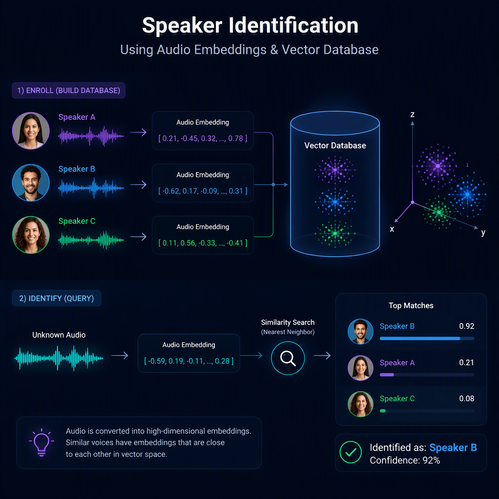
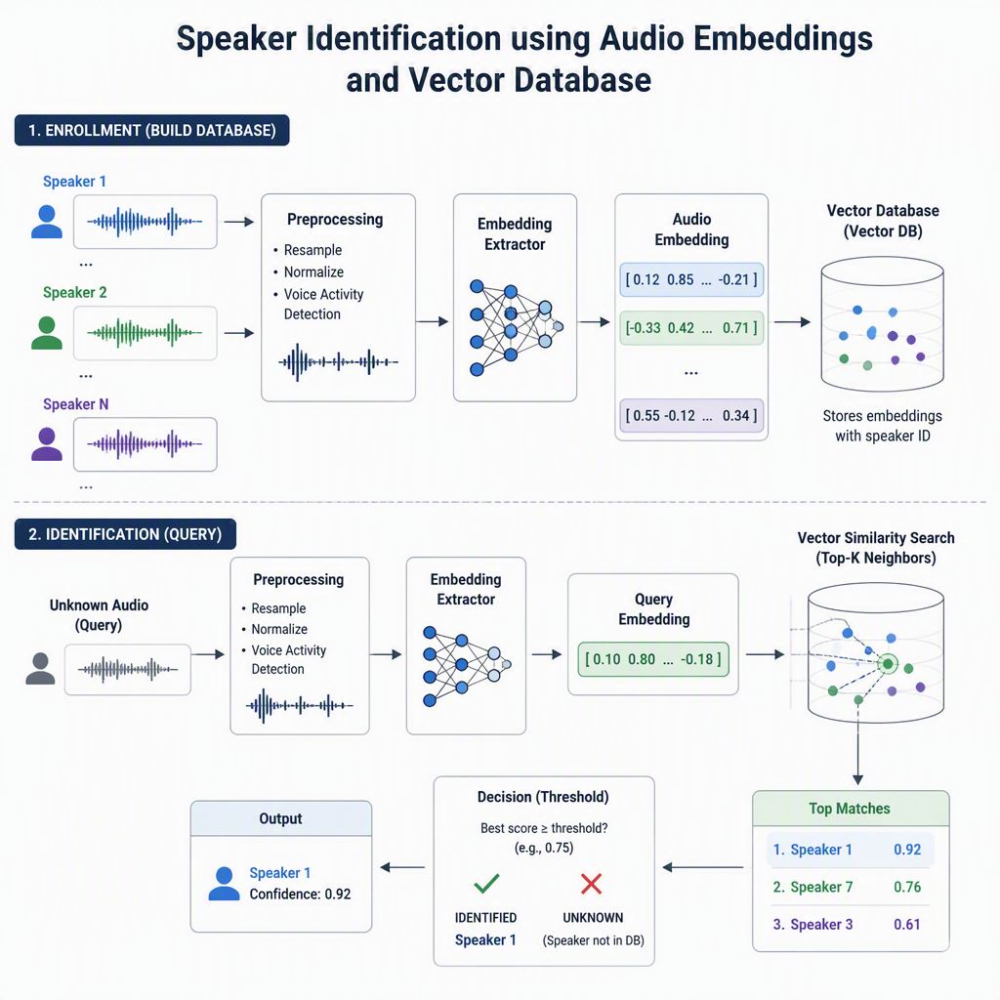

# 🎙️ Speaker Identification using Voice audio embeddings and Azure AI Search or Qdrant



<div align="center">


</div>

---


Speaker identification with embeddings and Azure AI Search or Qdrant for edge applications.

## Architecture Overview



## Overview

This repository contains implementations and experiments for **speaker identification** tasks using modern embedding techniques and vector search technologies. The project demonstrates how to leverage modern AI capabilities for accurate speaker recognition and verification.

## Key Features

- **Speaker Identification**: Identify speakers from audio embeddings
- **Embedding Generation**: Create vector representations of speaker characteristics
- **Azure AI Search Integration**: Use Azure's search capabilities for speaker matching
- **Qdrant Support**: Alternative vector database for storing and searching embeddings
- **Audio Processing**: Handle and process audio data for speaker recognition
- **Voice Verification**: Verify speaker identity from voice samples

## Technologies

- **Embeddings**: Vector representations for speaker characteristics
- **Azure AI Search**: Enterprise search solution for semantic matching
- **Qdrant**: Open-source vector database for similarity search
- **Azure Services**: Cloud-based services for scalability
- **Foundry**: Development and deployment framework
- **Python/Jupyter**: Analysis and development environment

## Project Structure

This is a Jupyter Python Notebook-based project.

## Use Cases

- **Speaker Verification**: Verify if a voice sample belongs to an enrolled speaker
- **Speaker Recognition**: Identify which speaker is present in audio
- **Voice Authentication**: Use speaker characteristics for authentication
- **Audio Analysis**: Analyze and classify audio based on speaker identity

## Getting Started

### Prerequisites

- Python 3.8+
- Jupyter Notebook
- Azure account (for Azure AI Search)
- Qdrant (optional, for vector database)
- Audio processing libraries

### Installation

1. Clone the repository:
```bash
git clone https://github.com/retkowsky/speaker-identification.git
cd speaker-identification
```

2. Install dependencies:
```bash
pip install -r requirements.txt
```

3. Configure your environment:
   - Set up Azure credentials for Azure AI Search
   - Configure Qdrant connection (if using)

### Usage

Open and run the Jupyter notebooks in this repository to:
- Process audio files
- Generate speaker embeddings
- Index embeddings in Azure AI Search or Qdrant
- Perform speaker identification tasks

## Architecture

The solution follows this workflow:

1. **Audio Input**: Load audio files or streams
2. **Feature Extraction**: Extract speaker characteristics
3. **Embedding Generation**: Convert features to embeddings
4. **Vector Indexing**: Store embeddings in Azure AI Search or Qdrant
5. **Similarity Search**: Query for matching speakers
6. **Speaker Identification**: Return identified speaker

## Vector Databases

### Azure AI Search
- Enterprise-grade search solution
- Scalable vector search capabilities
- Integration with Azure services

### Qdrant
- Open-source vector database
- Fast similarity search
- Docker deployment option

## Contributing

Contributions are welcome! Please feel free to submit pull requests or open issues.

## License

This project is provided as-is. Please check the repository for license information.

## Support

For issues, questions, or suggestions, please open an issue on the GitHub repository.

## Author

| Field | Details |
| --- | --- |
| Name | Serge Retkowsky |
| Created | September 4, 2026 |
| Last updated | September 4, 2026|
| Email | serge.retkowsky@microsoft.com |
| LinkedIn | https://www.linkedin.com/in/serger/ |
| Medium publications | https://medium.com/@sergems18/ |

